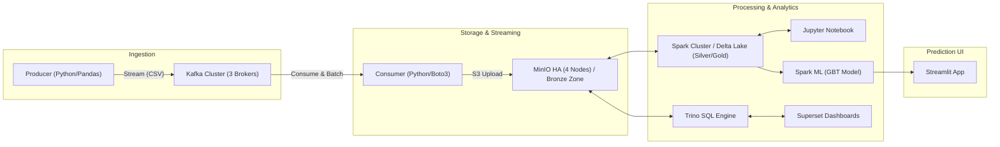

# TelcoDataFlowX: Real-Time Telco Data Pipeline

TelcoDataFlowX is a robust, distributed data architecture designed for streaming ingestion, high-availability storage, large-scale analytics, and machine learning on telecommunications data. This project implements a modern Data Lakehouse architecture using the Medallion (Bronze/Silver/Gold) pattern on top of Delta Lake and MinIO.

---

## Architecture



### Key Components

| Component | Description | Port |
|-----------|-------------|------|
| Apache Kafka | HA Cluster (3 brokers) for reliable message streaming | 9092-9094 |
| MinIO | High-Availability S3-compatible storage (4 nodes) | 9001 |
| Apache Spark | Distributed processing with Delta Lake support | 8080 |
| Jupyter Notebook | Interactive notebooks for data processing and ML | 8888 |
| Trino | High-performance SQL queries over the data lake | 8090 |
| Apache Superset | Business intelligence dashboards | 8088 |
| Streamlit | Churn prediction UI using trained ML model | 8501 |

---

## Data Pipeline

### Medallion Architecture

1. **Bronze Layer**: Raw data ingested from Kafka, stored as CSV files in MinIO
2. **Silver Layer**: Cleaned and validated data with proper schema (Delta Lake)
3. **Gold Layer**: Feature-engineered data ready for ML training (Delta Lake)

### Machine Learning Pipeline

- **Model**: Gradient Boosted Trees (GBT) Classifier
- **Target**: Customer Churn Prediction
- **Performance**: 87.88% AUC-ROC, 80.59% Accuracy
- **Storage**: Model saved to MinIO for serving

---

## Prerequisites

### Large JAR Files
Several JAR files are required for Hadoop and S3 (MinIO) compatibility. These are **not included** in the repository.

1. Create a `jars/` directory at the root of the project
2. Download the following files into `jars/`:
   - [aws-java-sdk-bundle-1.12.406.jar](https://repo1.maven.org/maven2/com/amazonaws/aws-java-sdk-bundle/1.12.406/aws-java-sdk-bundle-1.12.406.jar)
   - [aws-java-sdk-bundle-1.12.301.jar](https://repo1.maven.org/maven2/com/amazonaws/aws-java-sdk-bundle/1.12.301/aws-java-sdk-bundle-1.12.301.jar)
   - [hadoop-aws-3.3.6.jar](https://mvnrepository.com/artifact/org.apache.hadoop/hadoop-aws/3.3.6)
   - [hadoop-common-3.3.6.jar](https://mvnrepository.com/artifact/org.apache.hadoop/hadoop-common/3.3.6)

---

## Installation and Execution

### Quick Start

```bash
# Start all services
docker-compose up -d

# Wait for services to be healthy, then run the data pipeline
./pipeline_start_ingestion.sh
./pipeline_start_spark.sh
```

### Service URLs

| Service | URL | Credentials |
|---------|-----|-------------|
| Jupyter Notebook | http://localhost:8888 | Token: `spark123` |
| Spark Master UI | http://localhost:8080 | - |
| MinIO Console | http://localhost:9001 | minio / minio123 |
| Trino UI | http://localhost:8090 | - |
| Superset | http://localhost:8088 | admin / admin |
| Streamlit (Churn Predictor) | http://localhost:8501 | - |

### Pipeline Scripts

```bash
# Start ingestion (Kafka & MinIO)
./pipeline_start_ingestion.sh

# Start processing (Spark & Notebooks)
./pipeline_start_spark.sh

# Test high availability
./test_ha.sh

# Stop all services
./pipeline_stop_all.sh
```

---

## Project Structure

```text
.
├── consumer/               # Kafka Consumer (Python/Boto3)
├── producer/               # Kafka Producer (Python/Pandas)
├── spark/                  # Spark configuration and Notebooks
│   ├── app/notebooks/      # Bronze, Silver, Gold, ML Notebooks
│   └── conf/               # Spark configurations
├── trino/                  # Trino SQL engine configuration
│   ├── etc/                # Trino config files
│   └── init_analytics.sql  # Analytics views
├── superset/               # Superset configuration
│   └── superset_config.py  # Flask/SQLAlchemy config
├── streamlit/              # Churn Prediction UI
│   ├── app.py              # Streamlit application
│   ├── Dockerfile          # Container config
│   └── requirements.txt    # Python dependencies
├── jars/                   # (Manual) External dependencies
├── docker-compose.yaml     # Service orchestration
├── .env                    # Environment variables
└── pipeline_*.sh           # Automation scripts
```

---

## Trino Analytics Views

Three analytical views are available via Trino:

| View | Description |
|------|-------------|
| `view_master_dashboard` | Complete customer data for BI dashboards |
| `view_kpi_summary` | Aggregated single-row KPI metrics |
| `view_contract_metrics` | Statistics grouped by contract type |

Query example:
```sql
SELECT * FROM delta.telco_churn.view_master_dashboard LIMIT 100;
```

---

## Superset Dashboard

The Superset dashboard includes:
- Churn distribution pie chart
- Churn by contract type bar chart
- Churn by tenure group analysis
- Payment method breakdown table
- KPI summary cards (Total Customers, Churn Rate)

---

## Streamlit Churn Predictor

Interactive web application for real-time churn prediction:
- Input customer attributes (tenure, contract, charges, etc.)
- Get churn probability and risk assessment
- Receive actionable retention recommendations

---

## Contact

For questions regarding this project, contact:
**Akram Haggui** - akramhaggui2@gmail.com
**Malek Loghmari** - loghmarimalek@hotmail.com

